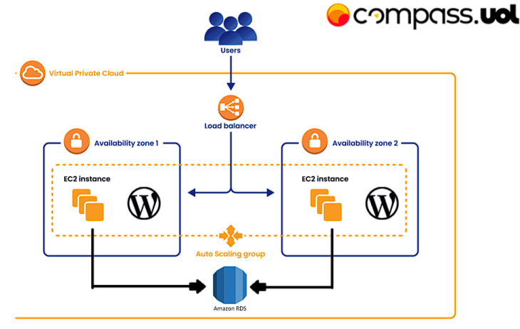
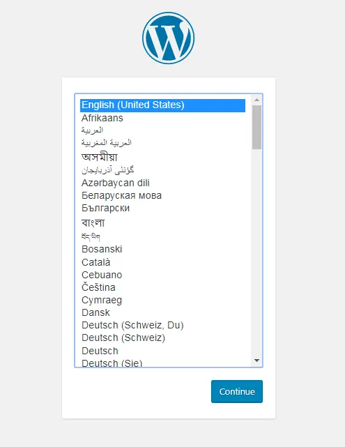

# Atividade de Docker na Nuvem AWS
_Projeto de Docker - Compass.UOL_

---

## Introdução

A atividade pede que criemos algumas instâncias EC2 com o Wordpress conteinerizado dentro, estas instâncias do Wordpress vão se conectar ao serviço RDS da Amazon (mySQL) e os arquivos estáticos do Wordpress serão guardados em um EFS montado dentro da EC2. A atividade também pede que usemos o Load Balancer como ponto de entrada e a única parte da arquitetura aberta em uma subrede pública, o restante deve estar em subredes privadas e com Auto-Scalling para aumentar ou diminuir quantas instâncias EC2 devem estar rodando, dependendo de alguns gatilhos específicos. Como mostra a imagem abaixo: 
    


---

### Índice

[Primeiros Passos e Testes:](#primeiros-passos-e-testes)
- [1. Criação da Instância EC2](#1-criação-da-instância-ec2)
- [2. Instalar o Docker na EC2](#2-instalar-o-docker-na-ec2)
- [3. Configurar o RDS](#3-configurar-o-rds)
- [4. Criar o Contêiner do Wordpress](#4-criar-o-contêiner-do-wordpress)
- [5. Criar a EFS e Conectá-la à EC2](#5-criar-uma-efs-e-conectá-la-à-ec2)

[Próximos Passos](#próximos-passos)
- [1. Criar uma VPC](#1-criar-uma-vpc)
- [2. Criar as Sub-redes](#2-criar-as-sub-redes)
- [3. Criar as Tabelas de Rotas e Internet Gateway](#3-criar-as-tabelas-de-rotas-e-internet-gateway)

---

## Primeiros Passos e Testes

### 1. Criação da Instância EC2

O EC2 é um dos pilares da nuvem AWS, precisamos fazer rodar o Wordpress dentro de uma instância EC2, já que esta é a principal base do projeto. Para iniciarmos uma instância, vamos em **Launch Instances** (prefiro usar a AWS em inglês, então todos os comandos AWS desta documentação serão em inglês).   
Agora a AWS nos dá outra página, nela vamos ter que configurar algumas coisas:
- Em **Name and tags**, podemos colocar um par chave-valor específico nosso, somente para diferenciação de uma instância para outra.
- Em **Application and OS Images** vamos selecionar uma máquina Ubuntu, não tem problema de deixar no padrão da Amazon Linux, mas como eu tenho mais familiaridade com o Ubuntu, preferi deixar nela.
- Em **Instance Type** deixaremos na t2.micro, já que o Wordpress do projeto não precisará de muitos recursos.
- Em **Key Pair** iremos criar um par de chaves para acessarmos a instância via SSH (lembrar de colocar esta chave num diretório que você use mais, já que toda vez que formos acessar a EC2, você precisa estar no diretório de onde está esta chave).
- Em **Network Settings** deixaremos no padrão, por enquanto, no futuro iremos configurar as Security Groups.
- Em **Configure Storage** deixaremos o padrão de 8GB gp3.
- Em **Advanced Details** não mexeremos em nada, por enquanto, mas no futuro é onde iremos inserir o user_data.sh. 

Feito tudo isto, devemos esperar alguns momentos para que a máquina esteja pronta para uso.

### 2. Instalar o Docker na EC2

Precisamos entrar na EC2, onde você baixou a chave key.pem (da parte de Key Pair acima) é de onde iremos acessar a máquina via SSH com o seguinte comando:
```bash
ssh -i "nome do arquivo da chave".pem ubuntu@"ipv4 público da Instância EC2"
 ``` 
 _Obs. Se usássemos uma máquina AMI Linux, teríamos que substituir o ubuntu do comando acima para ec2user._
Dentro da instância EC2 precisaremos baixar o docker, para isso, a documentação do docker pede que rodemos alguns comandos extensos, um para adicionar a chave oficial GPG do Docker:
``` bash
apt-get update
apt-get install ca-certificates curl
mkdir -p /etc/apt/keyrings /dev/null
install -m 0755 -d /etc/apt/keyrings
curl -fsSL https://download.docker.com/linux/ubuntu/gpg -o /etc/apt/keyrings/docker.asc
chmod a+r /etc/apt/keyrings/docker.asc
``` 
E outro para adicionar o repositório às fontes do apt:
``` bash
echo \
  "deb [arch=$(dpkg --print-architecture) signed-by=/etc/apt/keyrings/docker.asc] https://download.docker.com/linux/ubuntu \
  $(. /etc/os-release && echo "$VERSION_CODENAME") stable" | \
  sudo tee /etc/apt/sources.list.d/docker.list > /dev/null
apt-get update
```
Feito estes comandos, agora iremos baixar o docker, containerd e suas dependências:
``` bash
apt-get install docker-ce docker-ce-cli containerd.io docker-buildx-plugin docker-compose-plugin -y
```

Para evitar que o Docker funcione somente com acesso de root, devemos colocar o seguinte comando e depois resetar a instância para termos acesso ao Docker sem precisarmos usar o comando sudo antes de qualquer comando do docker:
``` bash
usermod -aG docker ubuntu
``` 
Agora já podemos instalar a imagem do Wordpress e fazer ele rodar, mas antes, temos que configurar o Banco de Dados, para que o Wordpress funcione corretamente. Neste projeto iremos usar o banco de dados MySQL do RDS (Relational Database Service) que a Amazon disponibiliza para nós, vamos então configurar o mesmo na próxima sessão.

### 3. Configurar o RDS

Na parte de RDS da AWS, iremos clicar em **Create database**, na página seguinte iremos mudar algumas coisas:
- Em **Choose a database creation method** não iremos mudar.
- Em **Engine Options** iremos escolher o MySQL.
- Em **Templates** iremos escolher free tier, já que o serviço RDS é bastante caro.
- Em **Availability and durability** não temos como mudar nada.
- Em **Settings** mudaremos o _**DB Instance modifier**_ para algum identificador único, depois em _**Credential settings**_ daremos um nome para o usuário mestre do banco de dados e depois colocaremos uma senha segura.
- Em **Instance configuration** iremos mudar apenas a parte de selecionar qual máquina será alocada para o RDS, iremos colocar o db.t3.micro.
- Em **Storage** não mudaremos nenhuma configuração.
- Em **Connectivity** não mudaremos nada ainda, mas no futuro, iremos colocar que ela deverá funcionar em uma nova VPC, onde iremos configurar uma topologia específica ao projeto.
De resto, não precisaremos mexer em mais nada, podemos apertar em Create database.
Teremos que esperar algum tempo para que o banco de dados funcione.

Para que o EC2 tenha acesso ao RDS teremos que mudar uma configuração no Security Group atual, teremos que editar as Inbound Rules no SG que estamos usando e especificar que queremos que as EC2 consigam acessar o MySQL pela porta 3306, como na imagem abaixo:

Agora já temos tudo necessário para que a instância EC2 tenha conexão com o RDS, o que possibilita que o Wordpress funcione.

### 4. Criar o contêiner do Wordpress

Agora que temos acesso ao RDS, vamos entrar na instância EC2 que tem o docker e fazer o contêiner do Wordpress, iremos usar o **docker compose** para facilitar o processo de construção do contêiner.
Dentro da EC2 vamos dar o seguinte comando: 
```bash 
sudo vim docker-compose.yaml
``` 
Nele, iremos escrever o manifesto que o docker compose usará para criar o Wordpress e fazer as conexões com o banco de dados, como a seguir:
```yaml
services:
  wordpress:
    image: wordpress
    restart: always
    ports:
      - 8080:80
    environment:
      WORDPRESS_DB_HOST: <db-host>
      WORDPRESS_DB_USER: <db-user>
      WORDPRESS_DB_PASSWORD: <db-pwd>
      WORDPRESS_DB_NAME: <db-name>
    volumes:
      - /efs/wordpress:/var/www/html
```
_Obs: Onde há aquelas variáveis de ambiente do banco de dados, você deverá colocar os valores atuais para o seu caso._ 

Vamos salvar o arquivo e sair (esc + :wq no vim)
Agora que temos o manifesto yaml pronto, iremos usar o docker para construir o contêiner, usaremos o seguinte comando no diretório que você colocou o arquivo docker-compose.yaml:
```bash
docker compose up -d
```
Se tudo ocorreu bem, o docker dirá que construir o contêiner mais uma rede própria do contêiner. Caso não tenha dado certo até aqui, recomendo ir na documentação do docker e ver se há algum problema com a instação ou com o docker compose: [Documentação do Docker](https://docs.docker.com/reference/).

Agora podemos pegar o IP público da EC2 e entrar na porta 8080 e ver se iremos ser recebidos por esta imagem:


_Obs: Um problema comum desta parte é o Wordpress avisar que não pôde fazer uma conexão com o Banco de Dados, resolução mais comum desse problema é alguma credencial errada no yaml file ou no Security Group, se tiver com este problema, recomendo dar uma revisada nestas partes_

Agora que temos um Wordpress funcional, iremos criar uma conexão da instância EC2 do Wordpress com o EFS (Elastic File System), para o Wordpress pegar seus arquivos estáticos independente do armazenamento das EC2.

### 5. Criar uma EFS e conectá-la à EC2.

Para criar um EFS é muito simples, apenas temos que dar um nome e dizer qual VPC queremos que ele use. Como estamos ainda na VPC Default, só iremos colocar um nome.

Agora temos um EFS para montarmos em nossa EC2 do Wordpress, vamos entrar na EC2 e dar o seguinte comando para iniciarmos o processo de montagem do EFS lá:
```bash
sudo apt update -y
sudo apt install nfs-common
```
O serviço nfs-common é necessário para montar file systems no Ubuntu, precisaremos dele, depois que ele estiver instalado, é hora de montarmos o EFS na máquina, teremos que ir na página da EFS e clicar em **Attach**.
Vamos copiar um dos comandos que ele descreve para gente, parecido com este abaixo:
```bash
sudo mount -t nfs4 -o nfsvers=4.1,rsize=1048576,wsize=1048576,hard,timeo=600,retrans=2,noresvport <endereço de DNS para o EFS vai aqui>:/ /efs
```
Dentro da EC2 devemos colar este comando e se tudo der certo, com o ```df -h``` ele mostrará como um dos file systems montados no sistema. Agora o diretório /efs servirá como o volume onde o Wordpress irá salvar seus arquivos estáticos.

_Obs: Se caso tenha erro nesta parte, provavelmente é algum erro da nfs-common ou de alguma configuração do EFS, como o Security Group._

---

## Próximos Passos

### 1. Criar uma VPC

Como a arquitetura proposta pede que criemos algumas sub-redes públicas e privadas, ficaria melhor criarmos uma VPC nossa, apesar que a AWS já cria uma default com tudo configurado.
Para criarmos uma VPC é muito simples, vamos seguir alguns passos:
1. Em **Name tag** daremos um nome único para a VPC.
2. Na parte de **IPv4 CIDR** criaremos um bloco de IP para nossa rede interna, dá para criar com o que ele dá de exemplo: 10.0.0.0/16.
_Obs: É bom lembrarmos deste IP, pois usaremos em algumas configurações_

De resto, não precisaremos mudar nenhuma opção, só criar a VPC.

### 2. Criar as Sub-redes.

Vamos criar agora as quatro sub-redes dentro da VPC que acabamos de criar (duas públicas e duas privadas), vamos criar a sub-rede pública de exemplo e as outras três é só repetir os passos:

1. Temos que especificar qual VPC iremos criar a sub-rede, importante selecionar a nova VPC.
2. Em **Subnet name** colocaremos o nome desta sub-rede, por exemplo: subnet-public-1.
3. Em **Availability zone** vamos especificar que queremos na us-east-1a.
4. Em **IPv4 VPC CIDR block** especificaremos aquele bloco que vimos na parte anterior: 10.0.0.0/16.
5. Em **IPv4 subnet CIDR block** iremos especificar o range de IPs que usaremos para esta sub-rede, vamos usar o 10.0.0.0/24 (Nas sub-redes posteriores iremos incrementar o terceiro octeto da faixa de IPs para não dar _overlap_).
6. Faremos os mesmos passos nas outras 3 sub-redes.

### 3. Criar as Tabelas de Rotas e Internet Gateway

Esta parte é simples, apenas dar um nome para a tabela de rotas, exemplo: public-table-route.
Depois temos que criar um Internet gateway, que também é só dar um nome, exemplo: wordpress-internet-gateway.

Agora temos que vincular estes objetos novos às sub-redes.

### 4. 